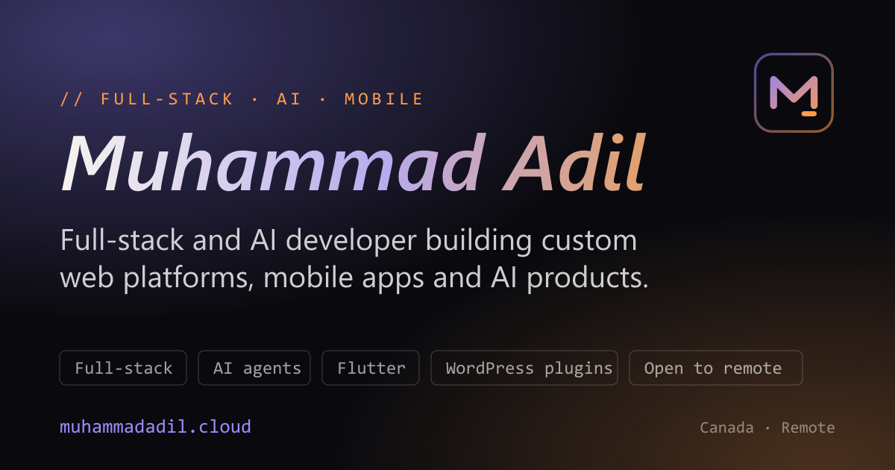

# Muhammad Adil — Developer Portfolio

**Live site:** [muhammadadil.cloud](https://muhammadadil.cloud)



A fast, animated single-page portfolio for Muhammad Adil, a full-stack and AI developer in Canada. It presents
case studies, client projects, skills grouped by evidence level, and a hiring-focused contact section.

## Highlights

- **Case studies with architecture diagrams.** Each case study explains the problem, what was built and how the
  pieces fit together, with an animated flow diagram.
- **Projects carousel.** Nine client projects with screenshots, a per-project role line and live links.
- **Honest skills.** Skills are labelled by where they come from: client work, personal projects or foundations.
- **Search-ready.** JSON-LD structured data (`ProfilePage`, `Person`, `ProfessionalService`), Open Graph and
  Twitter cards, `sitemap.xml`, `robots.txt`, a canonical URL and crawler-readable fallback content.
- **Accessible and responsive.** Skip link, keyboard-friendly navigation, reduced-motion support, an
  `aria-current` scroll-spy in the navbar and layouts tested from phone to wide desktop.
- **Performance-minded.** Lazy-loaded sections, WebP images and a preloaded hero image.

## Tech stack

| Area | Tools |
|---|---|
| UI | React 19, Tailwind CSS 4, Framer Motion |
| Build | Vite 8, ESLint |
| Hosting | Hostinger (Node.js), continuous deployment from `main` |

## Getting started

```bash
npm install
npm run dev      # start the dev server
npm run lint     # check code quality
npm run build    # production build into dist/
npm run preview  # serve the production build locally
```

Requires Node.js 20.19 or newer (Node 22 is used in production).

## Project structure

```text
src/
  components/    Hero, CaseStudies, ProjectsShowcase, ServicesOrbit, SkillsShowcase, Testimonials, ...
  data/          testimonials.js (real client feedback only; the section stays hidden while empty)
public/
  images/        project screenshots, hero image, social preview image
  files/         downloadable CV (PDF)
  sitemap.xml, robots.txt, site.webmanifest, icons
cv/              source (HTML) for the one-page CV and the generated PDF
index.html       meta tags, structured data and fallback content
```

## Updating content

- **Projects:** edit the `projects` array in `src/components/ProjectsShowcase.jsx`.
- **Case studies:** edit the `caseStudies` array in `src/components/CaseStudies.jsx`.
- **Skills:** edit `skillGroups` in `src/components/SkillsShowcase.jsx`.
- **Testimonials:** add entries to `src/data/testimonials.js` using a client's exact words or a screenshot.
- **CV:** edit `cv/cv.html`, print it to PDF and copy the result to `public/files/adil-cv.pdf`.

## Deployment

The site is deployed on Hostinger. Pushing to `main` triggers an automatic build (`npm run build`) and deploy.

## License

Copyright © Muhammad Adil. All rights reserved. The source is shared for reference. Please do not copy the design
or content without permission.

## Contact

[muhammad.adilk024@gmail.com](mailto:muhammad.adilk024@gmail.com) · [muhammadadil.cloud](https://muhammadadil.cloud)
